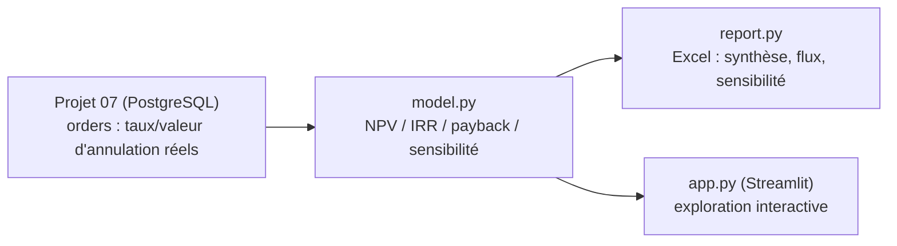

# Projet 16 — Business case : dispositif anti-annulation de commande

[](https://github.com/valentinratigniet-byte/projet-16-business-case-investissement/actions/workflows/ci.yml)

> Le livrable central d'un business analyst : traduire un constat opérationnel
> en décision d'investissement chiffrée — NPV, IRR, payback, sensibilité — et
> une recommandation écrite, pas juste un tableur. Le point de départ n'est
> pas inventé : **7,18 % des commandes** de la base du
> [Projet 07](https://github.com/valentinratigniet-byte/projet-07-base-ecommerce)
> sont annulées, mesuré sur 24 mois réels.

**Démo live** : *à venir — déploiement Streamlit Community Cloud, voir
[§ Déployer une démo publique](#-déployer-une-démo-publique)*.

## 🎯 Problème métier

Un fournisseur propose un dispositif anti-annulation (retry de paiement,
anti-fraude, réservation de stock au checkout). Combien ça vaut vraiment ?
Un chiffre unique ("ça rapporte X€") ne suffit pas pour engager un budget —
il faut la VAN, le TRI, le délai de retour sur investissement, **et** savoir
à partir de quel niveau de performance réel le projet devient rentable.

## 📄 Le mémo de décision

**[docs/memo_decision.md](docs/memo_decision.md)** — le vrai livrable : constat,
chiffrage, tableau de sensibilité, recommandation (**Go conditionnel**, pas
un feu vert aveugle), limites assumées. C'est ce qu'un comité d'investissement
recevrait.

## 📊 Résultats mesurés

| | Valeur |
|---|---:|
| Taux d'annulation actuel (mesuré) | 7,18 % |
| Valeur moy. d'une commande annulée (mesurée) | 1 788 € |
| NPV (cas de base : 2 pts récupérés, marge 25 %) | **+36 081 €** |
| IRR | **22,4 %** |
| Payback | **2,3 ans** |

La sensibilité (2 variables : points d'annulation récupérés × marge brute)
montre un **point de bascule net vers ~1,5 point** — en dessous, le projet
détruit de la valeur. Le cas de base n'a qu'une marge de sécurité étroite,
d'où la recommandation conditionnelle plutôt qu'un go inconditionnel.

## 🗂️ Architecture



`model.py` ne dépend d'aucune librairie financière externe : NPV est une
somme actualisée, IRR est trouvé par bissection sur `NPV(r) = 0` — quelques
lignes de stdlib suffisent, pas besoin de `numpy-financial`. Toutes les
hypothèses ont un `assert` associé (`self_check`) : NPV à taux 0 % doit
égaler la somme brute des flux, NPV(IRR) doit être ~0.

## 🚀 Reproduire

Prérequis : la base du [Projet 07](https://github.com/valentinratigniet-byte/projet-07-base-ecommerce)
doit tourner et être seedée (port 5433).

```bash
pip install -r requirements.txt
python src/model.py     # baseline + NPV/IRR/payback du cas de base (console)
python src/report.py    # dossier Excel complet (Synthèse, Flux, Sensibilité, Hypothèses)
streamlit run src/app.py  # explorateur interactif (ajuster les curseurs)
```

Sortie : `output/business_case_<AAAA-MM-JJ>.xlsx`. Exemple versionné :
`output/exemple_business_case.xlsx`.

## 🌐 Déployer une démo publique

`app.py` se connecte à la base Postgres du Projet 07 (`127.0.0.1:5433` en
local, via Docker) — injoignable depuis un hébergeur cloud. `fetch_baseline()`
gère ça proprement : si la connexion échoue, elle retombe automatiquement sur
un **instantané figé** des 3 chiffres mesurés le 28/08/2026 (voir
`src/model.py`, constante `SNAPSHOT`), affiché avec un bandeau explicite dans
l'app plutôt que de faire croire à une connexion live. Aucune base cloud à
héberger pour la démo.

Déploiement sur [Streamlit Community Cloud](https://streamlit.io/cloud)
(gratuit) :

1. Se connecter avec le compte GitHub `valentinratigniet-byte`.
2. "New app" → repo `projet-16-business-case-investissement`, branche `main`,
   fichier principal `src/app.py`. Rien d'autre à configurer :
   `requirements.txt` est déjà à la racine attendue.
3. Coller l'URL obtenue ici et dans l'entrée du portfolio
   (`portfolio-data/README.md` + `_github-profile/README.md`).

Comme le Projet 03 sur Render, le free tier peut se mettre en veille après
une période d'inactivité — premier chargement un peu plus lent, pas un bug.

## 🗃️ Structure du repo

```
projet-16-business-case-investissement/
├── README.md
├── docs/
│   └── memo_decision.md   ← le livrable : constat, chiffrage, sensibilité, recommandation
├── src/
│   ├── model.py           ← baseline (requête réelle) + NPV/IRR/payback, self-check
│   ├── report.py          ← export Excel (synthèse, flux, grille de sensibilité)
│   └── app.py             ← Streamlit interactif
└── output/
    └── exemple_business_case.xlsx
```

## 🧠 Choix de conception notables

- **Le constat est mesuré, pas inventé** : `fetch_baseline()` interroge la
  base du Projet 07 en direct (taux d'annulation, valeur moyenne). Seules les
  hypothèses de *décision* (marge, coût du dispositif, taux d'actualisation)
  sont assumées — et listées explicitement dans le rapport, pas cachées dans
  le code.
- **IRR par bissection, pas de dépendance financière** : `numpy-financial`
  n'est pas maintenu activement ; une bissection sur `NPV(r)` en 15 lignes de
  stdlib fait le même calcul et reste lisible.
- **Sensibilité à 2 variables plutôt qu'un seul chiffre** : un NPV unique
  masque la vraie question de gouvernance — à partir de quel niveau de
  performance le fournisseur doit-il s'engager contractuellement ?
- **Recommandation conditionnelle, pas un chiffre qui dit "oui"** : la
  sensibilité montre une marge de sécurité étroite sur le cas de base — un
  vrai mémo business analyst dit "sous conditions", pas juste "rentable".
- **Repli explicite plutôt que fausse connexion live** : la démo publique ne
  peut pas atteindre le Postgres local — `fetch_baseline()` retombe sur un
  instantané daté et l'affiche comme tel (bandeau dans l'app), au lieu de
  masquer silencieusement l'absence de données réelles. Vérifié par un step
  CI dédié qui force l'échec de connexion.

---

*Projet 16 du [Portfolio Data](https://github.com/valentinratigniet-byte). Réutilise la base du
[Projet 07](https://github.com/valentinratigniet-byte/projet-07-base-ecommerce). Prochaine brique :
Projet 17 — rentabilité produit/client.*
